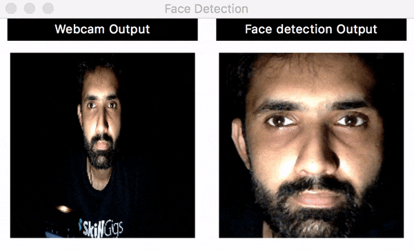

# Introduction
A Python application that detects face from live webcam video. It has a GUI coded with Tkinter, it fetches live webcam video, displays that video in left window of GUI and displays a face detected on right window of GUI.

If you more curios about how it runs in real time then this video might help.



## Motivation
My motivation for coding this project was that I was curios to learn and try them. 

## Files

Currently there are 2 code files. 
1. **GUI:** Contains all the code related to GUI. 
2. **Webcam-images-capture:** Contains code for webcam feed and face detection. 

**Note:** These files are in two formats, one is `Jupyter Notebook (.ipynb)` format  and other one is `Python (.py)` format. Python format is just an exported version of Jupyter Notebook, so basically they both are exactly same code wise. I used Jupyter Notebook for within code documentation purposes. 

Both of these are currently independent and can be run independently. 

## Dependencies 

* [Python 3.5](https://www.python.org/downloads/) or greater. 
* [OpenCV](http://opencv.org/about.html) library for image processing. 
    * ```pip3 install opencv```
* [Tkinter](https://wiki.python.org/moin/TkInter) library for GUI
    * ```pip3 install tkinter```
* [Queuelib](https://docs.python.org/3/library/queue.html) for background thread and main thread communication.
    * ```pip3 install queuelib```
* [Python Imaging Library (PIL)](https://pillow.readthedocs.io/en/4.1.x/) for Tkinter friendly image processing. 
    * ```pip3 install pillow```
* [Matplotlib](https://matplotlib.org/) for plotting purposes. 
    * ```pip3 install matplotlib```
* (Optional) [Jupyter Notebook](http://jupyter.org/install.html), if you want to run .ipynb files like I do then you have to install Jupyter Notebook. 

## Getting Started Guide

* Remember, currently both files are indepedent so they can be run independently. GUI is just a GUI (although fully dynamic and ready to be connected) running on a test image and webcam feed+face detection code runs separately. My next goal is to combine both codes to make GUI work with real camera feed. 
* Make sure all of the above must to have dependencies are met. 
* Follow the directory structure I have used in repo. For example `data` folder should be there in directory where code is placed. 

### Running Python (.py) Files

* For running `GUI.py` file
    * ```python3 GUI.py```
    
* For running `python3 Webcam-images-capture.py`
    * ```python3 Webcam-images-capture.py```

### Running Jupyter Notebook (.ipynb) Files 

* Type ```jupyter notebook GUI.ipynb``` and then a page will appear in your default browser. From that page's menu select `Cell` and then select `Run all`. 
* Same for file `Webcam-images-capture.ipynb`.


## Meta

Ramiz Raja – informramiz@gmail.com

Distributed under the MIT license. See ``LICENSE`` for more information.

[https://github.com/informramiz](https://github.com/informramiz)

## Contributing

1. Fork it (<https://github.com/informramiz/OpenCV-with-tkinter-and-threading/fork>)
2. Create your feature branch (`git checkout -b feature/fooBar`)
3. Commit your changes (`git commit -am 'Add some fooBar'`)
4. Push to the branch (`git push origin feature/fooBar`)
5. Create a new Pull Request
